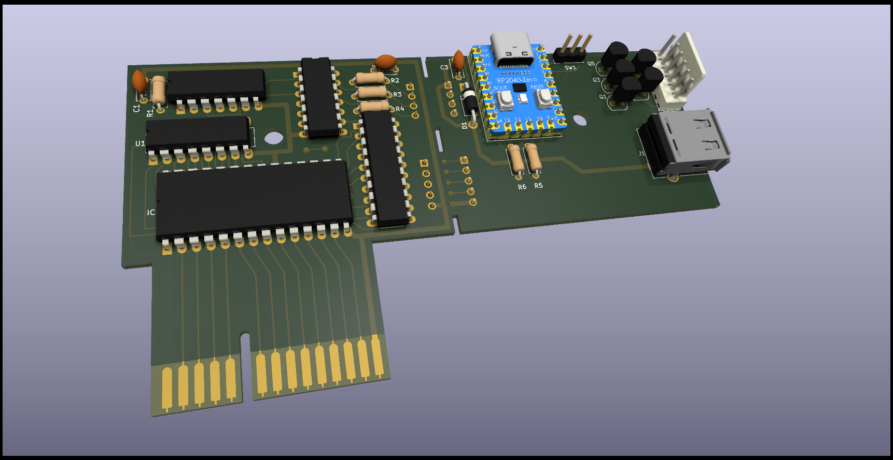
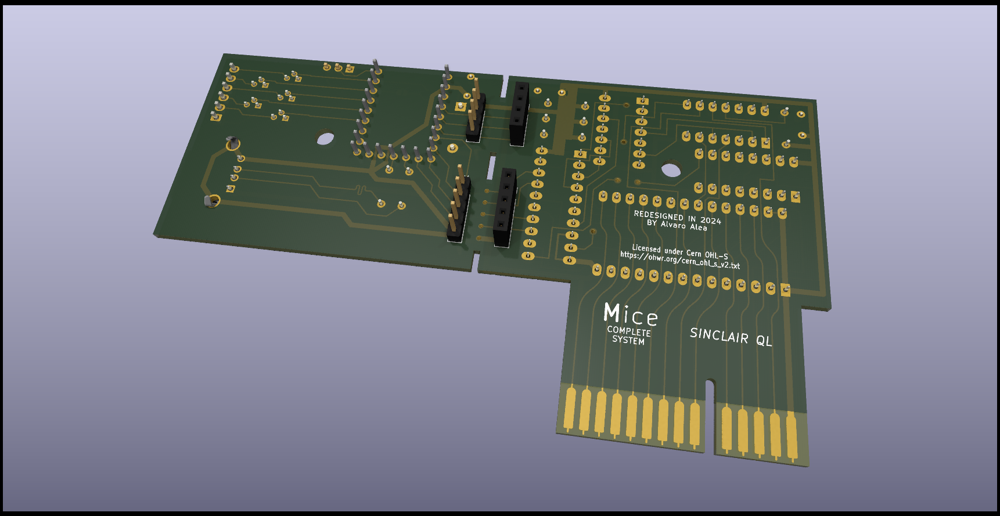

# QL_mIce_Starmouse
Mouse Interface for sinclair QL, mIce and Starmouse compatible

# NO WORKING YET

Reverse Engineered and adapted in 2024 by Alvaro Alea Fernandez

License under: CERN Open Hardware Licence Version 2 - Strongly Reciprocal

https://ohwr.org/cern_ohl_s_v2.txt

My work is only copy the design to Kicad, all (C) are retaing to the original owners.

# Introduction

ICE was a early graphic enviroment for the Sinclair QL, it was distributed in ROM Cartridge format, version 1 use keys, but version 2 incorporate a mouse for manage the enviroment.

This project Clone the hardware board that have a socket for a ROM chip, with ICE, and the circuit to manage te mouse, This Board has been design to match 1:1 the pictures I found of the original board, so can schematic and board can be usefull to repair the original Cartridge.

Original use a bus-mouse, a early kind of no-smart mouse where the signal of the encoders in X and Y are passed to the host computer, this kind of mouse area also used by BBC, Spectrum, Comodore Amiga, Atari ST and early PC XT, today is almost imposible to got one, so I add a second board, using a raspberry pi pico microcontroller that emulate this kind of mouses with a standard USB mouse. This board can also be used on other computer with the adecate wiring.

A Spanish Company develop another mouse interface for the QL, Starmouse, this interface emulate key push using the second Joystick port (that is also used for the F1-F5 keys) and got power from the cartridge port. This second board can also allow to emulate this mouse. if you connect the adecuate cable to the joystick port.

A small switch in the board will allow you to select, even on they fly, which mouse emulate.

Also included a PDF with a sticker and a 3D model to print a case for this interface.

There is also the program of the firmware to install on the raspberry pi pico. you should use a "waveshare RP-2024 Zero""

# Technical Information

This kind of mouse are not the best option for a moderm, multikasking operating system, there is no driver for the mouses, and the programs itself has to take care of pooling the device constantely to got the movement, for the Ice enviroment the vendor provide a toolkit (library) of routines to make easy the integration, but AFAIK, there where no aditional sofware that allow to use it. In the case of the Starmouse, there is only one program that use it, and there is no companion toolkit to use it.

There is no pointer enviroment driver for neither of the mouses.

# Pictures

# Links

https://qlwiki.qlforum.co.uk/doku.php?id=qlwiki:ice

https://qlwiki.qlforum.co.uk/doku.php?id=qlwiki:starmouse

https://sinclairql.speccy.org/articulos/historia/starmouse.htm

https://sinclairql.speccy.org/articulos/hardware/escarabajo.htm

https://www.waveshare.com/rp2040-zero.htm
